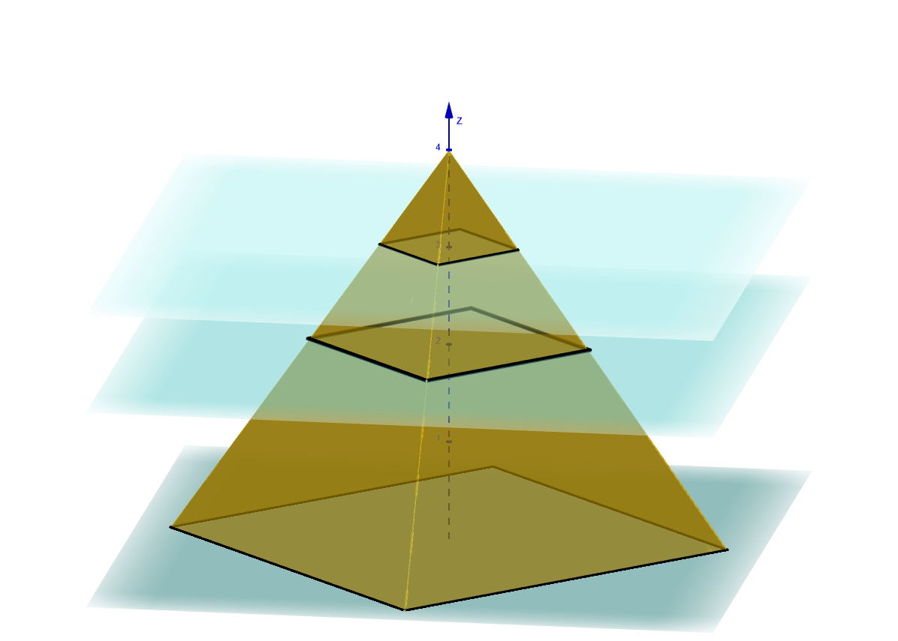
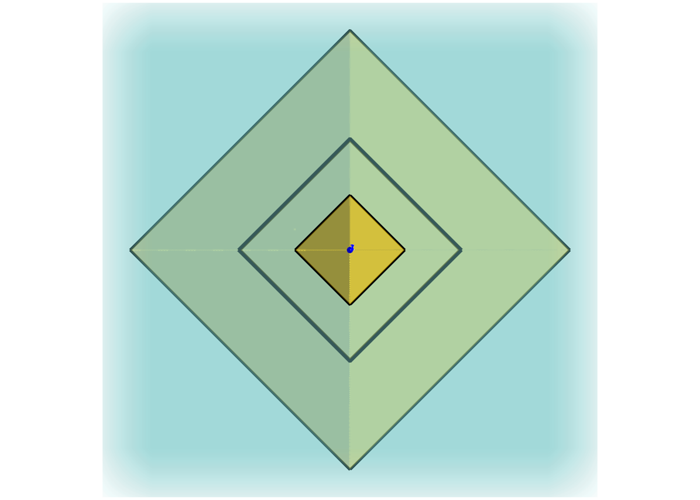
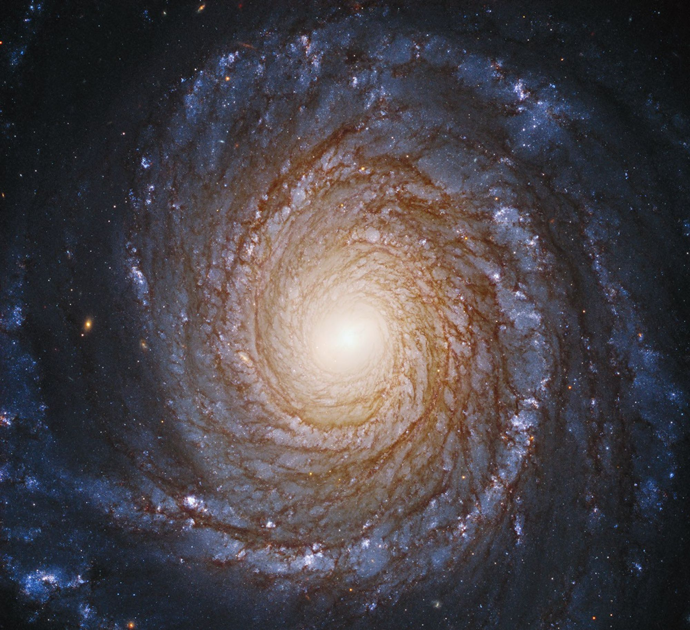

# Introduction 
When I think of self-similarity, the first thing that comes to my mind is Romanesco broccoli. The shape is indeed self-similar and mathematically closely related to a spiral. In simple words, self-similar means that no matter how much you zoom in, you will see the same shape. This thinking can then be applied not only to shapes (sets, functions), but also to equations. 

# Self-similarity of shapes/functions
Formally, a function $f(x)$ or a set $S$ is self-similar if scaling the input by a factor $\lambda$ changes the output in a predictable, proportional way:

$f(\lambda x) = \lambda^k f(x),$

where $k$ is a scaling exponent. Here are some intuitive real-world examples, some of which I am sure all of us have seen somewhere. 

This is a standard definition of a homogeneous function of degree $k$ that we learn in Calculus. A simple example of a self-similar shape is the pyramid given by the function

$$
f(x,y)=|x|+|y| 
$$ 
. 

The function is homogeneous of degree 1, with the level sets given by 

$$ 
|x|+|y|=c 
$$
, 

which are diamonds (squares rotated by 45 °). Now, if we scale the variables by a factor of 2: 

$$ 
|2x|+|2y|=c \implies |x|+|y|=c/2 
$$ 
.

This means that if you view the pyramid from above (looking down the $z$-axis) and zoom in by a factor of 2, you will see the same square shape with half the side length. Moreover, this remains true for any zooming factor: no matter how much you zoom in or out, the level sets keep the same shape, differing only by scale.

So the self-similarity in this example can be expressed by

$$
f(\lambda x, \lambda y) = |\lambda x| + |\lambda y| = c \implies  |x| + |y| = \frac{c}{\lambda} = \frac{1}{\lambda} c  
$$
.

Another interesting and closed-form example is the logarithmic spiral, which has exact geometric self-similarity. In the polar form, it can be expressed as

$$r(\theta)=r_0 e^{b\theta}$$
,

where $r_0>$ is the initial radius, $b\ne0$ controls how tightly the spiral winds and $\theta$ is the polar angle. 

So if we scale or zoom the spiral by a factor $\lambda$, i.e., 

$$
r\rightarrow \lambda r
$$
,

then 

$$
\lambda r(\theta) = r_0 e^{b (\theta+\Delta \theta)} 
$$
,

where $\Delta \theta = \frac{\ln \lambda}{b}$. And if we write in the Cartesian coordinates $x=r\cos(\theta), y = r\sin(\theta)$, then

$$
z = x+iy = r e^{i\theta} = r_0 e^{(i+b) \theta} 
$$
.

It turns out that when $\Delta \theta = \frac{\pi}{2}$, and $\lambda = \frac{1+\sqrt{5}}{2}$, the Golden ratio, then the corresponding spiral is  called the  Golden spiral. Hooreyyy!!! 

So the self-similarity in this example can be expressed as

$$
\lambda z(\theta) = z\left( \theta+\frac{\ln \lambda}{b} \right)
$$
.

This means zooming the entire curve is equivalent to rotating it; the shape remains the same, but not the size. 

 
*Image credit: www.nasa.gov (Public Domain).*

# Self-similarity of equations

Self-similar solutions of heat and Schrödinger equations. 

images in 1d and 2d. 

